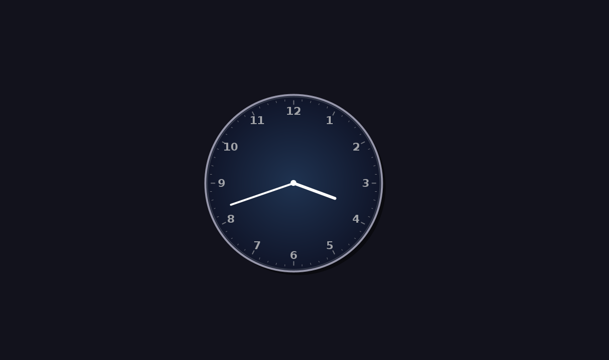
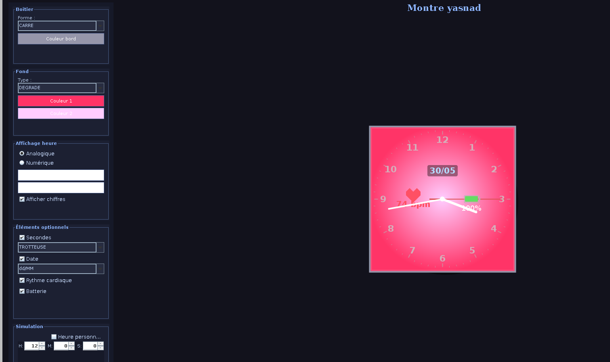

# Yasnad — Simulateur de montre connectée

Un simulateur de montre connectée personnalisable en Java avec interface graphique temps réel.

 

---

## Aperçu

| Analogique | Numérique | Tous les widgets |
|------------|-----------|------------------|
|  |  |  |

---

## Fonctionnalités

- **Affichage analogique & numérique** — aiguilles avec index ou texte HH:MM
- **Widgets modulaires** — secondes (trotteuse / mini-cadran / numérique), date, rythme cardiaque, batterie
- **Personnalisation complète** — forme du boîtier (rond, carré, arrondi), fond (uniforme / dégradé / image), couleurs
- **Simulation temporelle** — définir une heure de départ personnalisée
- **Config persistante** — sauvegarde et rechargement de chaque configuration (`.montre`)

---

## Installation & lancement

**Prérequis :** JDK 17+

    # Cloner le projet
    git clone https://github.com/nada-chetloul/smartwatch-java.git
    cd smartwatch-java

    # Compiler
    mkdir -p bin
    find src -name "*.java" | xargs javac -d bin -sourcepath src

    # Lancer
    java -cp bin montre.Main

---

## Structure du projet

## Structure du projet

    src/
    └── montre/
        ├── modele/
        │   ├── Montre.java
        │   ├── ElementMontre.java
        │   ├── Boitier.java
        │   ├── FondCadran.java
        │   ├── AffichageHeure.java
        │   ├── AffichageAnalogique.java
        │   ├── AffichageNumerique.java
        │   ├── ElementDate.java
        │   ├── ElementSecondes.java
        │   ├── ElementBatterie.java
        │   └── ElementRythmeCardiaque.java
        │
        ├── vue/
        │   ├── FenetreMontre.java
        │   ├── PanneauMontre.java
        │   └── PanneauConfig.java
        │
        └── serialisation/
            └── GestionnaireMontre.java

---

## Technologies

- **Java 17** — langage principal
- **Swing** — interface graphique
- **Sérialisation Java** — persistance de la configuration

---

## Auteures

**Nada Cherine Chetloul** L2 Informatique, Université de Picardie Jules Verne
